# Microsoft Intune Endpoint Management Lab

## Overview

This hands-on lab demonstrates practical **Microsoft Intune endpoint administration** using a Windows 11 virtual machine. The lab focuses on device enrollment, Microsoft Entra join, MDM management, configuration profiles, endpoint validation, and Windows compliance requirements.

The environment was built in a Microsoft 365 Business Premium test tenant and uses a fictional test user and a Windows 11 VirtualBox endpoint named `LAB-WIN11-01`.

> **Environment:** Personal lab / test tenant — not a production environment.

---

## Technologies & Concepts

- Microsoft Intune
- Microsoft Entra ID
- Windows 11 Pro
- Microsoft 365 Business Premium
- Mobile Device Management (MDM)
- Settings Catalog
- Configuration profiles
- Device compliance
- Microsoft Defender security requirements
- Windows device sync
- Group-based policy assignment
- Conditional Access integration

---

## Lab Objectives

- Configure scoped automatic MDM enrollment
- Join Windows 11 to Microsoft Entra ID
- Enroll and manage the endpoint through Microsoft Intune
- Build a Windows Settings Catalog baseline
- Assign policy through a pilot security group
- Configure inactivity lock and password requirements
- Block Windows Clipboard History
- Force/verify MDM synchronization
- Validate policy enforcement directly on the endpoint
- Configure Windows security compliance requirements
- Prepare the device for Conditional Access based on compliance

---

## 1. Scoped MDM Enrollment

I configured the Microsoft Intune **MDM user scope** to target a pilot group instead of enrolling every user in the tenant.

The pilot group was used to test enrollment and policies in a controlled scope before wider deployment.

### Evidence

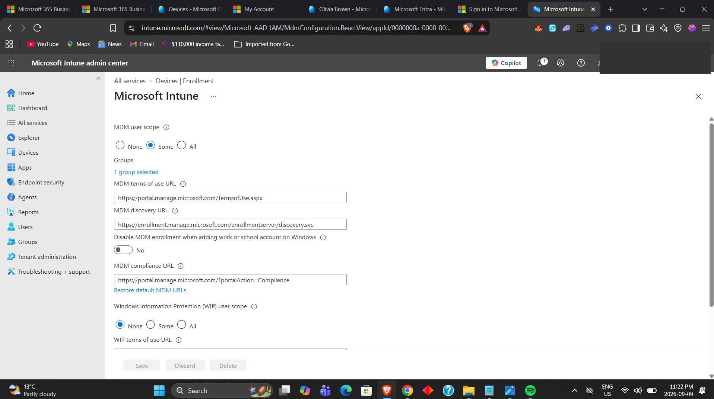

---

## 2. Microsoft Entra Join Verification

The Windows 11 lab endpoint was joined directly to Microsoft Entra ID.

I verified the join state locally with:

```cmd
dsregcmd /status
```

The device reported:

- `AzureAdJoined : YES`
- Device name: `LAB-WIN11-01`

### Evidence

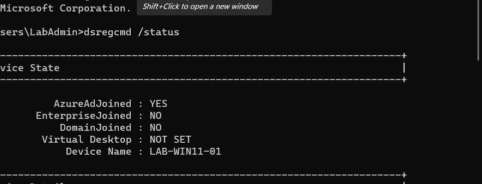

---

## 3. Intune Enrollment Verification

After enrollment, the device record showed:

- Join type: **Microsoft Entra joined**
- MDM: **Microsoft Intune**
- Security settings management: **Microsoft Intune**
- Compliance state: **Yes**

This confirmed that the endpoint was no longer just an Entra identity object — it was actively managed through Intune.

### Evidence

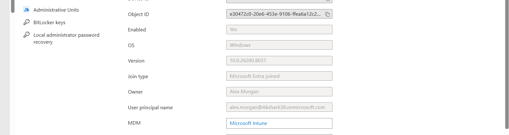

---

## 4. Managed Windows Device

Inside the Intune admin center, `LAB-WIN11-01` appeared as an actively managed Windows device.

The endpoint was identified as:

- **Corporate**
- **Intune managed**
- **Compliant**

### Evidence

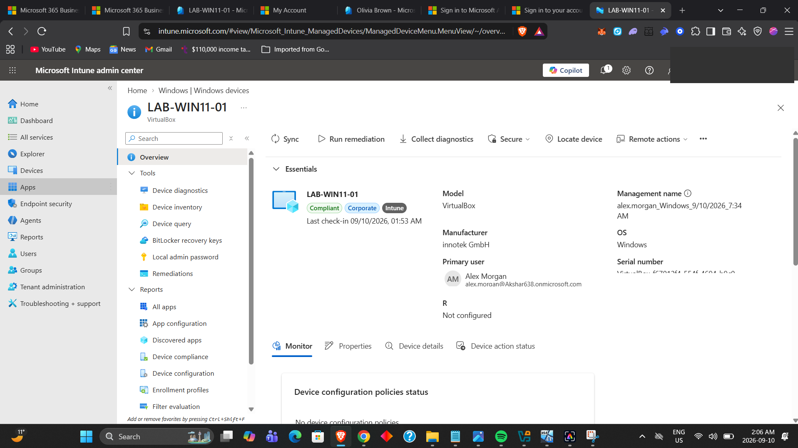

---

## 5. Windows Configuration Profile

I created a Settings Catalog policy named:

`WIN-PILOT-Baseline-Configuration`

The purpose of the profile was to demonstrate centralized Windows configuration through Microsoft Intune.

### Evidence

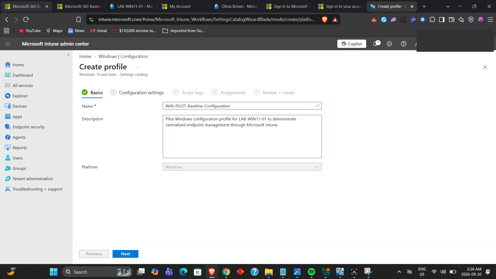

---

## 6. Baseline Security Configuration

The profile configured several endpoint controls, including:

- Device password enabled
- Maximum inactivity time: **15 minutes**
- Windows Clipboard History: **Blocked**

These settings demonstrate how an administrator can enforce endpoint behavior without manually configuring each computer.

### Evidence

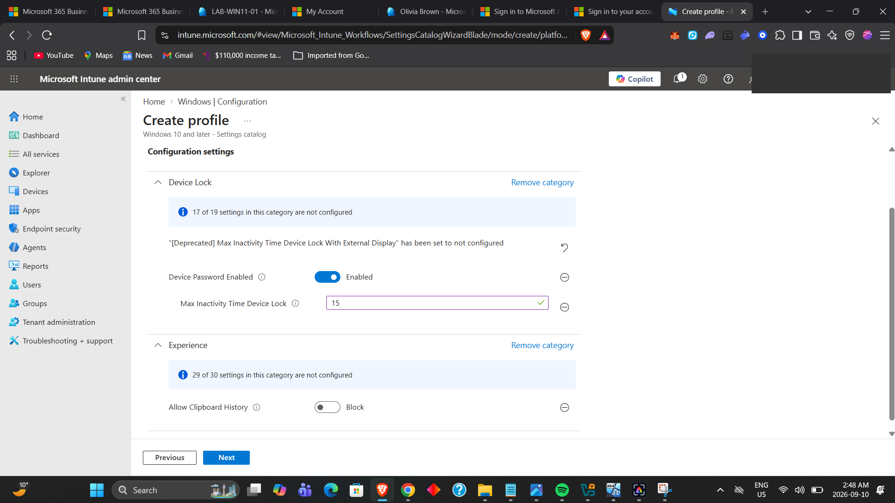

---

## 7. Group-Based Policy Assignment

The baseline configuration was assigned to the `SG-Intune-Pilot` security group.

Using a pilot group allows a configuration to be tested on selected users before a broader organizational rollout.

### Evidence

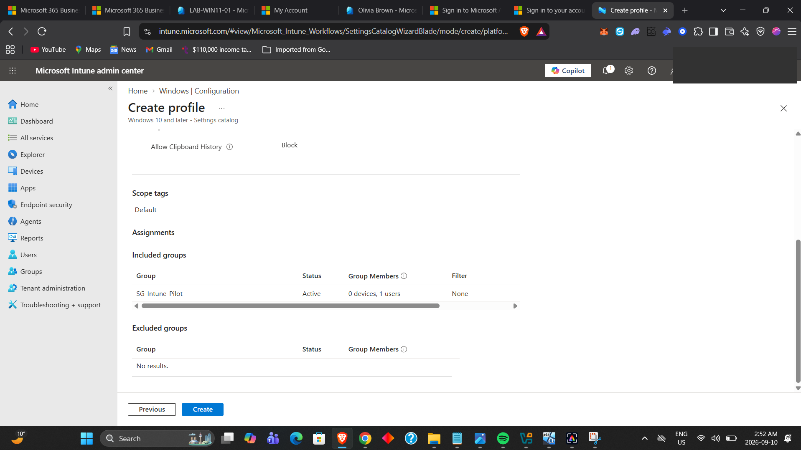

---

## 8. Windows MDM Synchronization

I manually synchronized the Windows endpoint with the organization management service and confirmed that the sync completed successfully.

This is useful during support and troubleshooting when an administrator needs a newly assigned configuration to be evaluated by the endpoint.

### Evidence

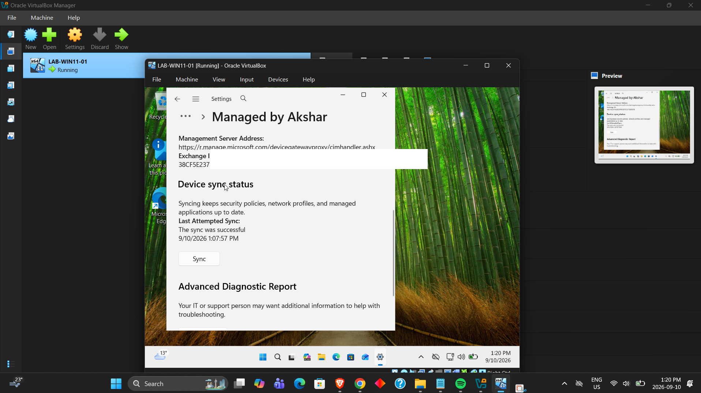

---

## 9. Endpoint Policy Enforcement

The Windows Clipboard settings displayed:

> **Some of these settings are managed by your organization.**

Clipboard History was disabled and unavailable to the user, demonstrating that the Intune configuration reached the Windows endpoint.

### Evidence

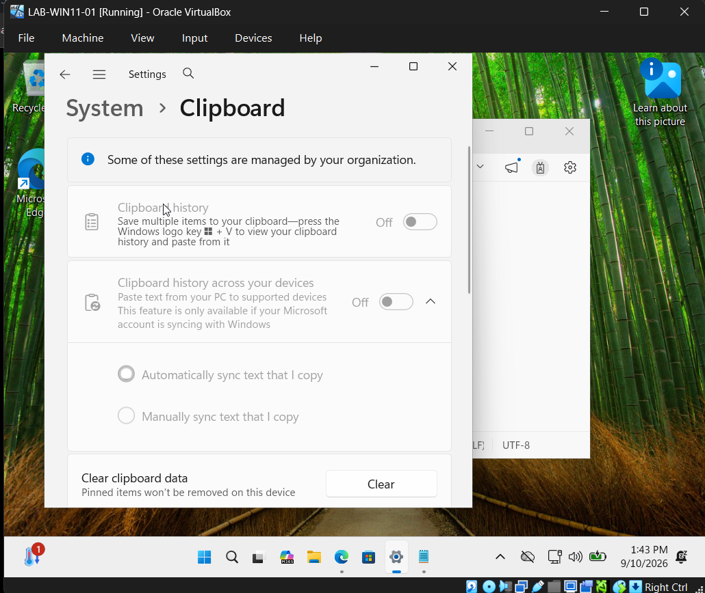

---

## 10. Functional Policy Validation

I performed an additional endpoint test by copying sample text and opening the Windows clipboard-history interface.

The copied value did not appear in Clipboard History because the feature had been disabled by policy.

This provided endpoint-level validation rather than relying only on the Intune portal.

### Evidence

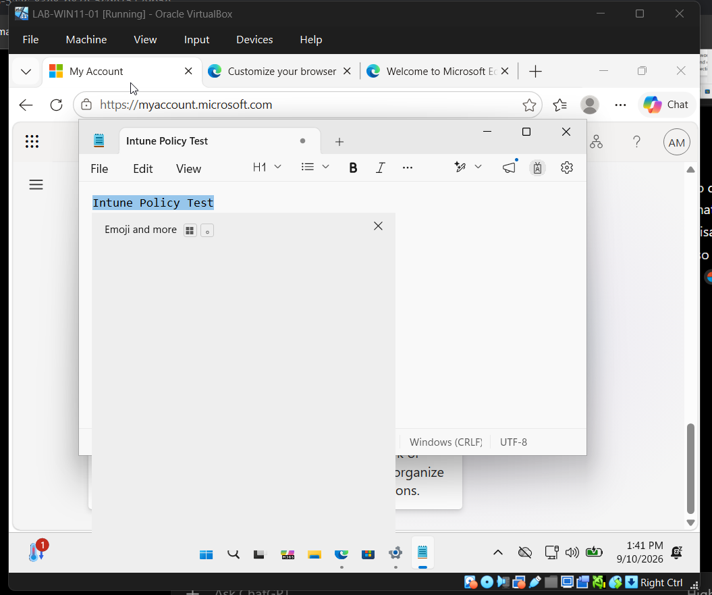

---

## 11. Windows Compliance Policy — Device Health

I configured Windows compliance requirements for boot and integrity protections.

The policy included:

- Secure Boot: **Require**
- Code integrity: **Require**
- BitLocker: Not configured for this lab

### Evidence

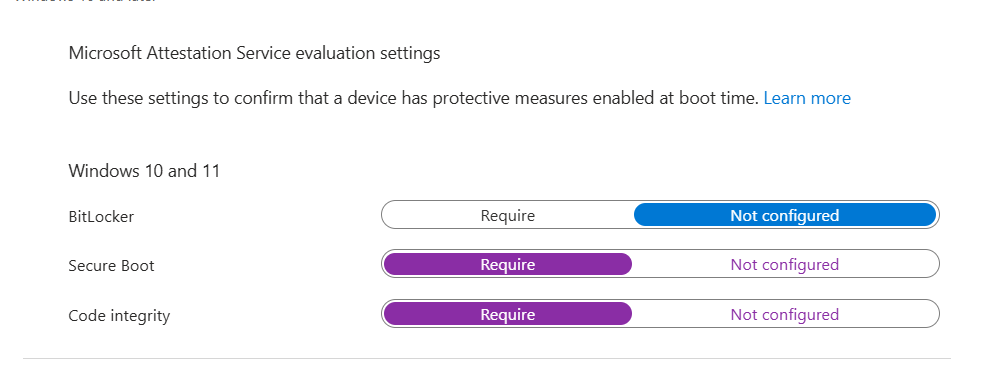

---

## 12. Windows Compliance Policy — System Security

Additional compliance requirements included:

- Firewall: **Require**
- Trusted Platform Module (TPM): **Require**
- Antivirus: **Require**
- Antispyware: **Require**
- Microsoft Defender Antimalware: **Require**
- Defender security intelligence up to date: **Require**
- Real-time protection: **Require**

### Evidence

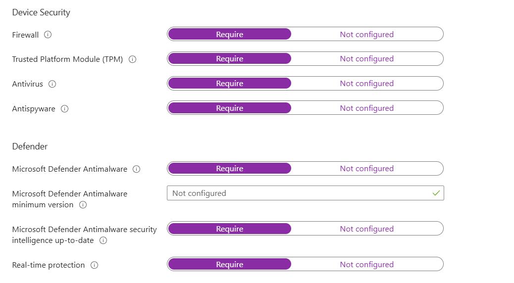

---

## Validation Approach

For each major configuration, I followed a simple enterprise-support workflow:

1. Configure the policy in Intune.
2. Scope the policy to a pilot group.
3. Synchronize the managed endpoint.
4. Verify the state in the Intune / Entra portals.
5. Validate the behavior directly on Windows.
6. Use the resulting device-compliance state with Conditional Access testing.

---

## Skills Demonstrated

- Microsoft Intune administration
- Windows 11 MDM enrollment
- Microsoft Entra device join
- Managed-device administration
- Settings Catalog configuration
- Group-based policy assignment
- Endpoint security configuration
- Windows device synchronization
- Policy enforcement validation
- Windows compliance-policy configuration
- TPM / Secure Boot / Defender compliance concepts
- Pilot deployment methodology
- Intune + Entra + Conditional Access integration

---

## Practical IT Support Relevance

These tasks map directly to common Service Desk and endpoint-management responsibilities such as:

- Enrolling Windows devices
- Confirming whether a device is managed
- Checking Entra join state
- Forcing device synchronization
- Troubleshooting policy delivery
- Applying security baselines
- Validating configuration at the endpoint
- Reviewing compliance status
- Supporting access policies that depend on device compliance

---

## Key Takeaway

This lab demonstrates the relationship between the Microsoft cloud-management components:

**Microsoft Entra ID** → identifies the user and device  
**Microsoft Intune** → manages endpoint configuration  
**Compliance Policy** → evaluates whether the endpoint meets security requirements  
**Conditional Access** → can use that compliance state when deciding whether access should be allowed

---

## Related Projects

- Microsoft Entra ID Identity & Access Management Lab
- Windows Server & Active Directory Administration Lab
- Microsoft 365 Administration & User Support Lab
